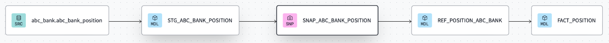
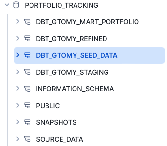

# Portfolio Tracking - Data Engineering with dbt and Snowflake

## Currently working on:
- Ensure reliability by adding tests.

## Recently worked on:
- Macros to keep consistency by reusing code.
    - Refactored "current" CTE from snapshots into a macro.
    - Fixed interpreted dates using macro.
- Using dbt packages.
    - Installed dbt-utils package and refactored stage models to use the package for creating hashes.

## TODO:
- Add a few more dimensions to the project to provide more useful info on the fact.
